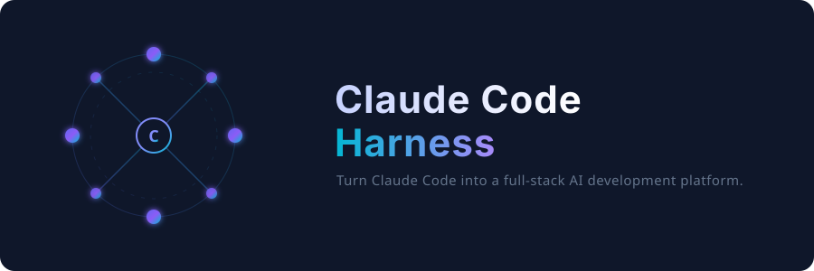

# Claude Code Harness

<p align="right">
  <a href="README_ZH.md">中文</a>
</p>

<p align="center">
  
</p>

<p align="center">
  <b>Turn Claude Code from a chat tool into a full-stack AI development platform.</b><br>
  8 core MCPs · 23 skills · 30 agents · decision-tree routing · degradation fallbacks
</p>

<p align="center">
  
</p>

<p align="center">
  <a href="LICENSE"></a>
  <a href="#"></a>
  <a href="#"></a>
</p>

---

## What is this?

Claude Code ships with **zero pre-configuration**. Every user spends hours:

- Wiring MCP servers one by one
- Writing a CLAUDE.md from scratch
- Finding and installing skills
- Debugging authentication and paths
- Figuring out which tool to use for which task

**This harness gives you a battle-tested, production-ready setup in one command.**

---

## One-command install

```bash
git clone https://github.com/cqh-xmf/claude-code-harness.git ~/.claude-harness
bash ~/.claude-harness/scripts/install.sh
```

Restart Claude Code. Done.

---

## What you get

### 8 Core MCPs (pre-configured, auto-started)

| MCP | What it does |
|-----|-------------|
| `context7` | Live docs lookup for any library/framework/SDK |
| `sequential-thinking` | Chain-of-thought reasoning for complex problems |
| `memory` | Cross-session knowledge graph |
| `filesystem` | Scoped file operations |
| `magic` | 50+ animated React UI components |
| `playwright` | Browser automation & testing |
| `github` | Full GitHub operations (PR, Issue, search) |
| `firecrawl` | Web scraping → Markdown |

### 17 On-Demand MCPs (cataloged, one command to enable)

Search: `exa-web-search`, `tavily`, `brave-search`
Media: `fal-ai`, `figma`
Platform: `notion`, `slack`, `linear`, `jira`, `confluence`, `supabase`
Deploy: `vercel`, `cloudflare-docs`, `clickhouse`
Browser: `browserbase`, `browser-use`
Tools: `longhand`, `evalview`, `devfleet`

```bash
bash ~/.claude-harness/scripts/mcp-toggle.sh enable fal-ai   # enable one
bash ~/.claude-harness/scripts/mcp-toggle.sh enable-all search  # enable group
bash ~/.claude-harness/scripts/mcp-toggle.sh list              # see all
```

### Intelligent Tool Routing

You talk naturally. The router picks the right tool.

| You say... | It uses... |
|------------|-----------|
| "Make a PPT" | `pptx` skill |
| "Build a landing page" | `frontend-design` skill |
| "Add animation to this component" | `ui-animation` skill |
| "Review my code" | `code-reviewer` agent |
| "Write tests for this" | `tdd-guide` agent |
| "Check this for security issues" | `security-reviewer` agent |
| "What does React 19's API look like?" | `context7` MCP |
| "Scrape that page" | `firecrawl` MCP |
| "Create a logo" | `svg-logo-designer` skill |

### Degradation Strategy

If a tool fails, it doesn't block your task. The harness auto-falls-back.

| Tool down | Auto-fallback |
|-----------|--------------|
| `context7` timeout | WebSearch + manual docs |
| `playwright` fails | `webapp-testing` skill |
| `github` MCP fails | Native `git` CLI |
| `firecrawl` timeout | `WebFetch` |
| Any search MCP | `WebSearch` |
| Any agent | Manual completion |

### Anti-Dust System

Tools you never use get flagged. No wasted context window.

### Project Templates

Drop a ready-made CLAUDE.md into any new project.

```bash
cp ~/.claude-harness/templates/project-claude-md/react.md ./CLAUDE.md
```

Templates: `react` · `python` · `node` · `nextjs` · `generic`

### Health Check & Performance Baseline

```bash
bash ~/.claude-harness/scripts/mcp-health.sh
```

Shows: which MCPs are active, cold-start timing, token status, runtime versions.

---

## Architecture

```
                    ┌─────────────────────────────┐
                    │     CLAUDE.md (Router)       │
                    │  "What does the user need?"  │
                    └─────────────┬───────────────┘
                                  │
          ┌───────────────────────┼───────────────────────┐
          │                       │                       │
          ▼                       ▼                       ▼
   ┌──────────────┐      ┌──────────────┐      ┌──────────────┐
   │  8 Core MCPs │      │  23 Skills   │      │  30 Agents   │
   │  (auto-load) │      │  (on-demand) │      │  (on-demand) │
   └──────────────┘      └──────────────┘      └──────────────┘
          │                       │                       │
          └───────────────────────┼───────────────────────┘
                                  │
                          ┌───────▼────────┐
                          │  Fallback Map   │
                          │  Tool A↓ → B    │
                          └────────────────┘
```

---

## File Structure

```
claude-code-harness/
├── README.md                   ← You are here
├── README_ZH.md                ← 中文版
├── LICENSE                     ← MIT
├── .gitignore                  ← Protects your secrets
├── CLAUDE.md                   ← The router (copy to ~/.claude/)
├── settings.template.json      ← MCP config template
├── scripts/
│   ├── install.sh              ← One-command bootstrap
│   ├── mcp-toggle.sh           ← Enable/disable MCPs
│   └── mcp-health.sh           ← Health check + timing
├── mcp-configs/
│   └── on-demand-mcps.json     ← 17 additional MCP catalog
├── templates/
│   └── project-claude-md/      ← Per-project CLAUDE.md templates
│       ├── react.md
│       ├── python.md
│       ├── node.md
│       ├── nextjs.md
│       └── generic.md
└── docs/
    ├── architecture.md
    ├── agents-catalog.md
    └── screenshots/
```

---

## Requirements

- **Claude Code** v2.1.150+ (any platform)
- **Node.js** 18+ (for npx-based MCPs)
- **Git** (for github MCP)
- **Python 3** (for mcp-toggle.sh)

### Optional tokens (for full functionality)

| Token | Purpose | Get it at |
|-------|---------|-----------|
| `DEEPSEEK_API_KEY` | If using DeepSeek proxy | platform.deepseek.com |
| `GITHUB_PAT` | GitHub MCP | github.com/settings/tokens |
| `FIRECRAWL_API_KEY` | Web scraping | firecrawl.dev |

---

## Security

- **NEVER commit `settings.json`** — it contains API keys. Use `settings.template.json`.
- All MCP commands run locally. No data leaves your machine except through APIs you explicitly configure.
- API keys are read from environment variables (not hardcoded in template).
- `.gitignore` blocks `settings.json`, `.env`, backups, and personal directories.

---

## FAQ

**Q: Does this replace my existing CLAUDE.md?**
A: It augments it. The harness CLAUDE.md goes to `~/.claude/CLAUDE.md` (global). Your project CLAUDE.md stays in your project root. Both are loaded.

**Q: What if I already have some MCPs configured?**
A: The install script backs up your existing `settings.json` before generating a new one.

**Q: Can I remove MCPs I don't need?**
A: Yes. `mcp-toggle.sh disable <name>` removes it cleanly. Or edit `settings.json` directly.

**Q: Does this work with official Anthropic API?**
A: Yes. Just set `ANTHROPIC_BASE_URL` and `ANTHROPIC_AUTH_TOKEN` accordingly in the top-level `env` of `settings.json`.

---

## Contributing

See [CONTRIBUTING.md](CONTRIBUTING.md).

New MCPs, skills, and routing rules are welcome. Open an issue or PR.

---

## License

MIT — use it, fork it, ship it.

---

<p align="center">
  <sub>Built for developers who want Claude Code at full power, instantly.</sub>
</p>
