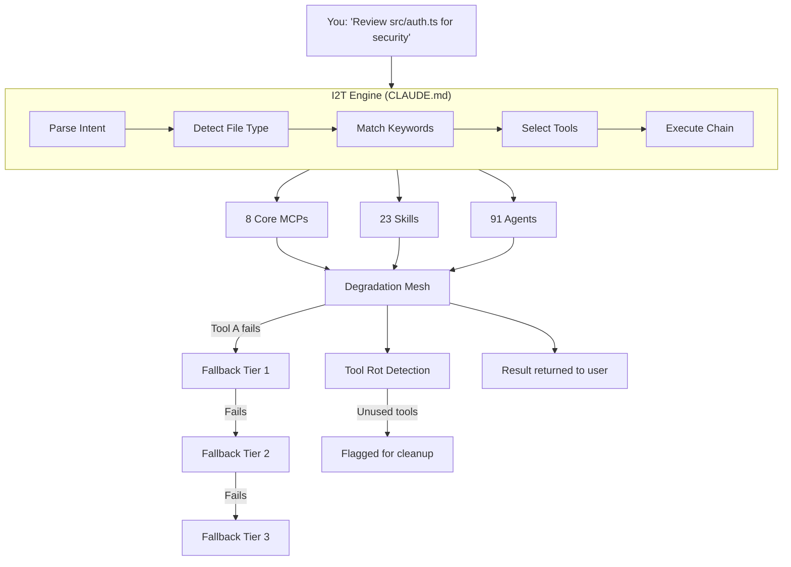

# Architecture

## Overview

Claude Code Harness transforms vanilla Claude Code into a full-stack AI development platform through four layers:



## Layer 1: I2T Engine (Intent-to-Tool Mapping)

The core innovation. A natural-language compiler that translates human intent into tool execution chains.

```
Input: "Build a landing page"
  → Keyword: "landing page" → frontend-design skill
  → Keyword: "build" → planner agent (plan first)
  → Context: new project → react.md template
  → Execute: planner → frontend-design → magic MCP (for components)
```

## Layer 1: Infrastructure

### Core MCPs (auto-loaded)
These 8 MCP servers start with Claude Code and provide foundational capabilities. They are carefully selected to maximize utility while minimizing context window consumption:

- **context7**: Documentation as a service — any library, any version, instantly
- **sequential-thinking**: Structured reasoning for complex multi-step problems
- **memory**: Persistent knowledge graph across sessions
- **filesystem**: Scoped file operations (read, write, search within allowed directories)
- **magic**: 50+ pre-built animated React components
- **playwright**: Full browser automation (screenshots, testing, interaction)
- **github**: Repository operations (PR, Issue, code search, API)
- **firecrawl**: Web content extraction to clean Markdown

### On-Demand MCPs (17 additional)
Cataloged but not auto-loaded. Enable temporarily when needed, disable when done. This saves context window for everyday work while keeping specialized tools available.

### Skills (23)
Claude-internal skills for document generation, design, and specialized tasks. Invoked on-demand by the routing layer.

### Agents (30+)
Specialized sub-agents for code review, security audit, testing, and language-specific tasks.

## Layer 2: Intelligence — The Decision Tree

The heart of the harness. Instead of requiring users to memorize tool names, the routing table maps natural language intent to the right tool.

### How it works

1. User says "Make a presentation about Q3 results"
2. CLAUDE.md is loaded as system context
3. The router sees "Make a presentation" → `pptx` skill
4. `pptx` skill is invoked automatically
5. User never needs to know the skill name

### Categories

- **Search/Research**: context7, WebSearch, firecrawl, exa-web-search
- **UI/Frontend**: frontend-design, ui-animation, magic, canvas-design
- **Documents**: pptx, docx, xlsx, pdf
- **Testing**: tdd-guide, e2e-runner, webapp-testing
- **Code Review**: security-reviewer, typescript-reviewer, python-reviewer, etc.
- **Design**: svg-logo-designer, theme-factory, brand-guidelines

## Layer 3: Resilience

### Degradation Strategy

Every tool has a fallback. If a tool fails, the task doesn't fail — it degrades gracefully to the next-best alternative and notifies the user.

### Anti-Dust System

Tools that are never used across multiple sessions get flagged. This prevents context-window bloat from unused MCPs and skills.

### Health Monitor

`mcp-health.sh` provides:
- Active MCP enumeration
- Cold-start timing per MCP
- Token/environment variable validation
- Runtime version checks

## Design Decisions

### Why not load all 25 MCPs at once?
Context window is precious. Loading 25 MCPs would consume significant tokens before the user even starts. Core 8 cover 90% of daily tasks. The remaining 17 are one command away.

### Why Bash scripts instead of Node.js?
Bash works everywhere Claude Code runs (Windows Git Bash, macOS, Linux). Zero dependencies beyond what the OS provides. Python is used sparingly for JSON manipulation.

### Why decision tree in CLAUDE.md instead of a separate tool?
CLAUDE.md is Claude Code's native configuration mechanism. It's loaded into context automatically every session. No additional installation, no configuration, no learning curve.
